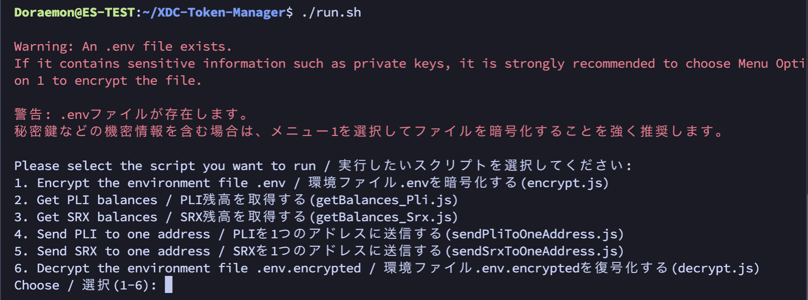

# XDC-Token-Manager

[README Japanese version](./README_Japanese.md)

This repository enables you to check the balance of XDC and XRC20 tokens and transfer funds from multiple wallets to a single wallet.

## Background of Repository Creation

1. Owning SRX nodes or PLI nodes allows you to receive monthly rewards. However, it's not easy to check if the rewards have been credited when you have multiple nodes. Therefore, we consolidate the XDC, SRX, and PLI balances of each wallet and output them in a csv file.
2. Also, we want to consolidate the rewards received from multiple wallets into one wallet. Doing so reduces the balance of the wallets to zero, making it easier to understand the next rewards received and simplifies the manual transfers when selling on exchanges.

## Key Points

- While it is possible to check the balance using just a wallet address, a private key is required for transfers. However, managing private keys is extremely important, so we use a `.env` file, further encrypted and protected by a password.

## 1. Copy Repository
```
cd && git clone https://github.com/11ppm/XDC-Token-Manager
cd ~/XDC-Token-Manager
chmod +x run.sh
```

## 2. Environment Check

- You need to have `Node.js` and `npm` installed on Ubuntu. To check this, execute the following commands in the terminal:
- Plugin nodes have them installed, SRX nodes do not. Either way, use a test machine rather than a production machine.

```
node -v
npm -v
```

- If `Node.js` is not installed, run the following command:

```
sudo apt update && sudo apt install nodejs npm -y 
```

## 3. Install npm Packages

- Install three npm packages: `xdc3`, `dotenv`, and `readline-sync`.

```
npm install xdc3 dotenv readline-sync
```

- `xdc3`: A JavaScript library for interacting with the Ethereum network
- `dotenv`: A library for managing environment variables in Node.js applications
- `readline-sync`: A library for handling interactive user input in Node.js applications

By installing these, you can utilize their respective functionalities.

## 4. Edit `.env`
- Enter the private keys for your XDC Wallet. For now, they are written from `PRIVATE_KEY_1` to `PRIVATE_KEY_10`. You can increase or decrease the number as needed. If no private keys are entered, they will be ignored.
- Enter the recipient wallet address to which you want to send funds from multiple wallets at `YOUR_RECIPIENT_WALLET_ADDRESS`. The address should start with 'xdc'. Don't forget the recipient.
- If you plan to use the created `.env` file in the future, store it securely on your local PC.


## 5. Execute Command

```
./run.sh
```



- If you're running it for the first time, always choose option 1 first. This will encrypt your `.env`. As a result, an encrypted `.env.encrypted` file and a `keys.json` necessary for decryption are created, and the `.env` is deleted. Without `.env.encrypted` and `keys.json`, decryption is not possible.

### 1. Encrypt environment file .env (encrypt.js)
- You need to edit the `.env` beforehand
- Enter an arbitrary password twice. Don't forget the password you enter. Never share your private keys or password with others, and keep them in a safe place.
- The `.env` file will be deleted
### 2. Get PLI balances (getBalances_Pli.js)
- Output in a csv file
### 3. Get SRX balances (getBalances_Srx.js)
- Output in a csv file
### 4. Send PLI to one address (sendPliToOneAddress.js)
- Sent to the `YOUR_RECIPIENT_WALLET_ADDRESS` in your `.env`. If forgotten, run `6.` to decrypt the `.env`
### 5. Send SRX to one address (sendSrxToOneAddress.js)
- Sent to the `YOUR_RECIPIENT_WALLET_ADDRESS` in your `.env`. If forgotten, run `6.` to decrypt the `.env`
### 6. Decrypt environment file .env.encrypted (decrypt.js)
- Without `.env.encrypted` and `keys.json`, decryption is not possible. Backup these two to restore the `.env`.

## 6. Check XDC and PLI balances on Apothem

Some may be afraid to run it on the Mainnet. Although it's just for peace of mind, we have prepared a single code for Apothem.
```
node apothem_getBalances_Pli

.js
```
Get test XDC and PLI from the following:
- Apothem XDC : https://faucet.blocksscan.io/
- Apothem PLI : https://faucet.goplugin.co/