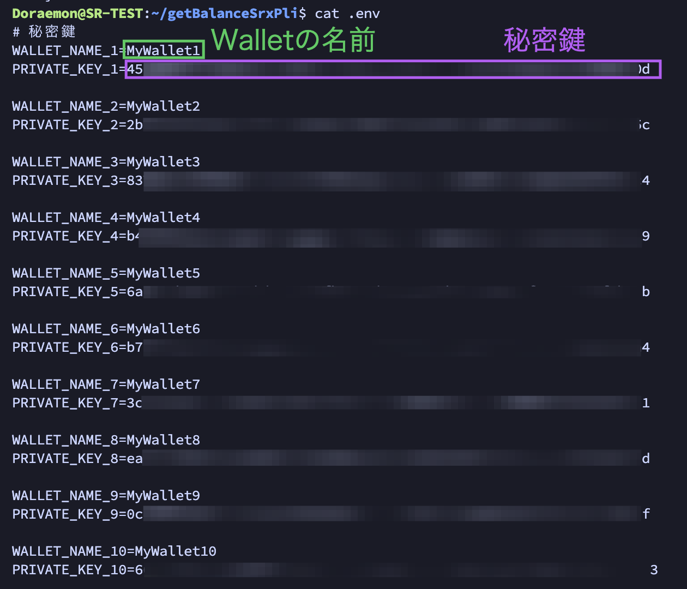
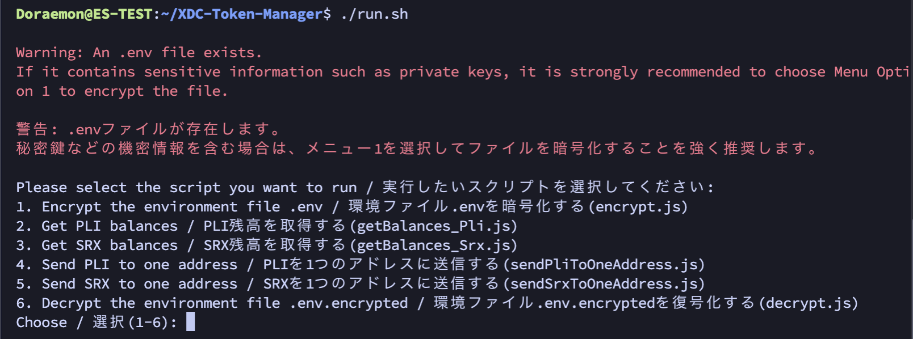

# XDC-Token-Manager

[README 英語版](./README.md)

これは、XDCやXRC20（XDCトークン）の残高を確認したり、複数のWalletから1つWalletに送金できるようにするリポジトリです。

## リポジトリを作成した背景

1. SRXノードやPLIノードを保有していると、毎月報酬を受け取りますが、ノードが複数ある場合、報酬が入ったかどうかの確認などが簡単ではありません。それでWallet毎のXDCとSRX, XDCとPLIの残高をまとめて、csvファイルで出力します。
2. またSRXノードやPLIノードの報酬を受け取った複数のWalletを1つのWalletに送金して、まとめたくなります。そうすることで、Walletの残高が0になり、次回の受け取った報酬がわかりやすくなりますし、取引所で売却する時でも手作業による送金が1度で済みます。

## ポイント

- 残高を確認するだけならばWalletアドレスがあれば可能なのですが、送金には秘密鍵が必要になります。しかしながら秘密鍵の管理は極めて重要なために、`.env`ファイルを使用しつつ、さらに暗号化し、パスワードで保護をすることにしました。


## 1. リポジトリをコピー
```
cd && git clone https://github.com/11ppm/XDC-Token-Manager
cd ~/XDC-Token-Manager
chmod +x run.sh
```

## 2. 実行環境の確認

- Ubuntuで`Node.js`と`npm`がインストールされている必要があります。それを確認するには、ターミナルで以下のコマンドを実行してください。
- Pluginノードには、入っています。またSRXノードには入っていません。いずれにせよ本番機ではせずに、テスト機を使うようにしてください。

```
node -v
npm -v
```

- `Node.js`がインストールされていない場合は、以下のコマンドを実行します。

```
sudo apt update && sudo apt install nodejs npm -y 
```

## 3. npmパッケージをインストール

- `xdc3`と`dotenv`と`readline-sync`という3つのnpmパッケージをインストールします。

```
npm install xdc3 dotenv readline-sync
```

- `xdc3`: Ethereumネットワークとやり取りするためのJavaScriptライブラリ
- `dotenv`: Node.jsアプリケーションで環境変数を管理するためのライブラリ
- `readline-sync`: Node.jsアプリケーションでユーザーとの対話的な入力を処理するためのライブラリ

これらをインストールすることで、それぞれの機能を利用できるようになります。


## 4. `.env`の編集
- XDCWalletの秘密鍵を記入します。とりあえず`PRIVATE_KEY_1`から`PRIVATE_KEY_10`まで書いています。必要な数だけ増減することができます。秘密鍵が記入されていない場合は、スルーされます。
- 複数ウォレットから1つのウォレットに送金する宛先・ウォレットアドレス`YOUR_RECIPIENT_WALLET_ADDRESS`を記入してください。アドレスの頭は、xdcから始まって結構です。送金先は忘れないようにしてください。
- 作成した`.env`を今後も使う可能性がある場合は、ローカルPCなどで現住に保管しておいてください。



## 5. 実行コマンド

```
./run.sh
```



- はじめて実行する場合は、必ず最初に選択肢1を選んでください。`.env`を暗号化します。その結果、暗号化された`.env.encrypted`ファイルと複合化に必要な秘密鍵など`keys.json`が作成され、`.env`は削除されます。`.env.encrypted`と`keys.json`がなければ、復号化はできませんので、ご注意ください。

### 1. 環境ファイル .env を暗号化する (encrypt.js)
- `.env`を先に編集しておく必要があります
- 任意のパスワードを2回を入力します。入力したパスワードは、忘れないでください。秘密鍵やパスワードを決して他者とは共有せず、安全な場所に保管してください。
- `.env`ファイルは削除されます
### 2. PLI残高を取得する (getBalances_Pli.js)
- csvファイルで出力されます
### 3. SRX残高を取得する (getBalances_Srx.js)
- csvファイルで出力されます
### 4. PLIを1つのアドレスに送信する (sendPliToOneAddress.js)
- `.env`の`YOUR_RECIPIENT_WALLET_ADDRESS`宛に送金されます。忘れた場合は、`6.`を実行して、`.env`を復号化してください
### 5. SRXを1つのアドレスに送信する (sendSrxToOneAddress.js)
- `.env`の`YOUR_RECIPIENT_WALLET_ADDRESS`宛に送金されます。忘れた場合は、`6.`を実行して、`.env`を復号化してください
### 6. 環境ファイル .env.encrypted を復号化する (decrypt.js)
- `.env.encrypted`と`keys.json`がなければ、復号化はできません。この2つをバックアップしておくと、`.env`は復元することができます。

## 6. Apothem の XDC と PLI 残高確認

Mainnetで実行するのが怖い方もおられると思います。気休め程度ですが、実際にどのように動作するのかをApothem用に1つだけコードを用意しました。
```
node apothem_getBalances_Pli.js
```
テスト用XDCとPLIは以下から取得してください
- Apothem XDC : https://faucet.blocksscan.io/
- Apothem PLI : https://faucet.goplugin.co/


